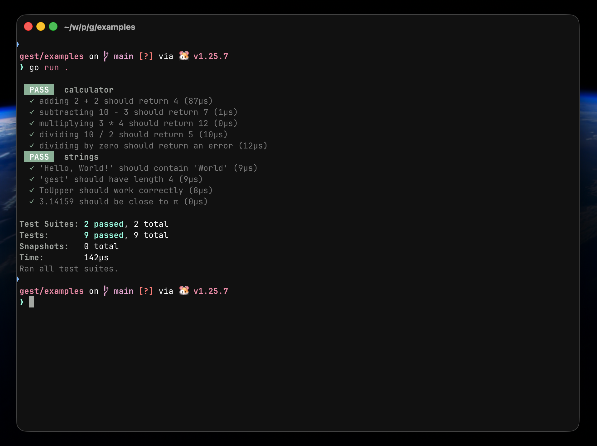
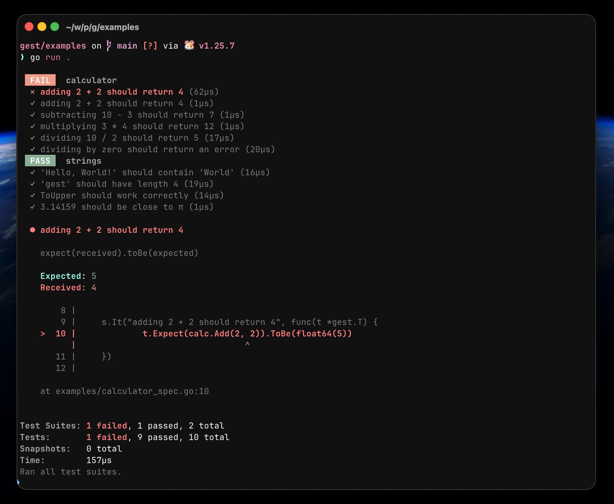
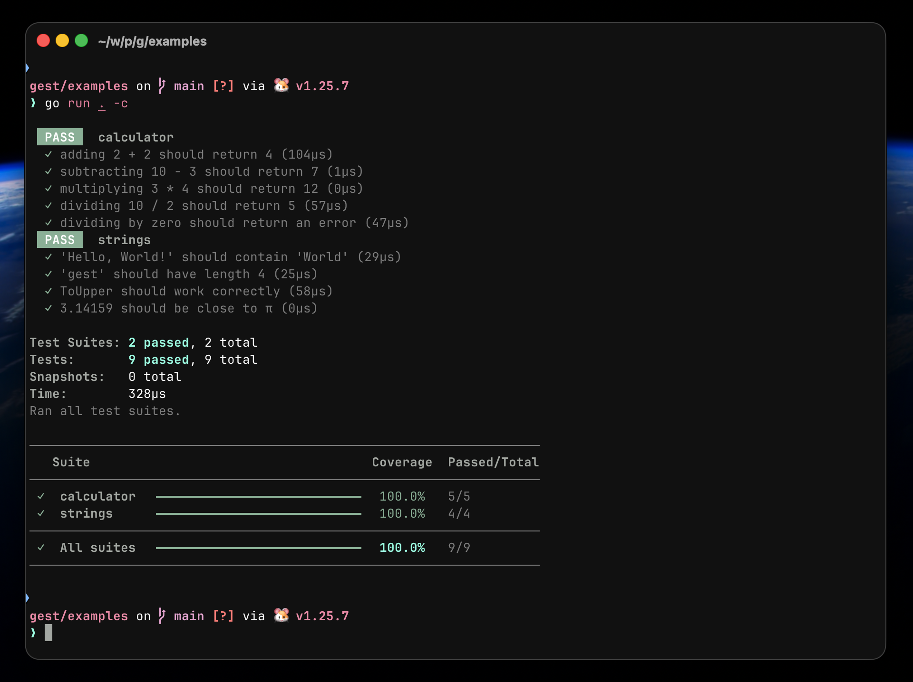

<div align="center">


<h1>gest</h1>

<p>A Jest-inspired testing framework for Go — beautiful output, zero dependencies.</p>

<p>
  <a href="https://github.com/caiolandgraf/gest/actions/workflows/ci.yml">
    
  </a>
  <a href="https://pkg.go.dev/github.com/caiolandgraf/gest">
    
  </a>
  <a href="./LICENSE">
    
  </a>
</p>

<p>
  <a href="https://caiolandgraf.github.io/gest/"><strong>📖 Documentation</strong></a>
  &nbsp;·&nbsp;
  <a href="#installation">⚡ Quick Start</a>
  &nbsp;·&nbsp;
  <a href="#matchers">🔍 Matchers</a>
  &nbsp;·&nbsp;
  <a href="#full-api">📦 Full API</a>
</p>

</div>

---



## Motivation

Go's built-in `go test` is powerful but raw. **gest** brings Jest's developer experience to Go: colored output, descriptive failure messages with code snippets, and a fluent assertion API — all in a single file with zero external dependencies.

## Installation

```bash
go get github.com/caiolandgraf/gest
```

## Project structure

```
my-project/
├── go.mod
├── main.go              ← just calls gest.RunRegistered()
├── calculator.go
├── calculator_spec.go   ← self-registers via init()
├── user.go
└── user_spec.go         ← self-registers via init()
```

> **Why `_spec.go` instead of `_test.go`?**
> The `_test.go` suffix is reserved by the Go toolchain for `go test`.
> gest uses `go run`, so any other suffix works — `_spec.go` is a common convention.

## Basic usage

**`main.go`** — doesn't need to know which spec files exist:

```go
package main

import (
    "os"

    "github.com/caiolandgraf/gest/gest"
)

func main() {
    if !gest.RunRegistered() {
        os.Exit(1)
    }
}
```

**`calculator_spec.go`** — each file self-registers:

```go
package main

import "github.com/caiolandgraf/gest/gest"

func init() {
    calc := Calculator{}
    s := gest.Describe("calculator")

    s.It("adding 2 + 2 should return 4", func(t *gest.T) {
        t.Expect(calc.Add(2, 2)).ToBe(float64(4))
    })

    s.It("dividing by zero should return an error", func(t *gest.T) {
        _, err := calc.Divide(10, 0)
        t.Expect(err).Not().ToBeNil()
    })

    gest.Register(s)
}
```

**Run:**

```bash
go run .           # run all tests
go run . -c        # run with coverage table
```

## Failure messages

When a test fails, gest shows exactly what went wrong — just like Jest:



## Coverage

Pass `-c` or `--coverage` to display the per-suite pass rate:

```bash
go run . -c
```



Bar colors: 🟢 green ≥ 80% · 🟡 yellow ≥ 50% · 🔴 red < 50%

## Matchers

| Matcher | Description |
|---|---|
| `.ToBe(v)` | Strict equality (`==`) |
| `.ToEqual(v)` | Deep equality (`reflect.DeepEqual`) |
| `.ToBeNil()` | Value is `nil` |
| `.ToBeTrue()` | Value is `true` |
| `.ToBeFalse()` | Value is `false` |
| `.ToContain(s)` | String contains substring |
| `.ToHaveLength(n)` | Length of string, slice or map |
| `.ToBeGreaterThan(n)` | Number greater than `n` |
| `.ToBeLessThan(n)` | Number less than `n` |
| `.ToBeCloseTo(n, delta?)` | Float approximately equal (default ±0.001) |

### Negation

Any matcher can be negated with `.Not()`:

```go
t.Expect(err).Not().ToBeNil()
t.Expect("gest").Not().ToContain("jest")
t.Expect(result).Not().ToBe(float64(0))
```

## Full API

```go
// Create a test suite
s := gest.Describe("suite name")

// Add a test case
s.It("description", func(t *gest.T) {
    t.Expect(value).ToBe(expected)
})

// Register the suite with the global runner
gest.Register(s)

// In main.go: run everything that was registered
gest.RunRegistered()

// Or, for manual control:
gest.RunAll(suite1, suite2, suite3)
```

## Example

See the [`examples/`](./examples) folder for a working project with multiple spec files.

```bash
cd examples
go run .
go run . -c
```

## Philosophy

- **Zero dependencies** — stdlib only
- **Zero config** — no config files, no separate CLI
- **Auto-discovery** via `init()` — just add a `_spec.go` file and it runs
- **Beautiful output** — colors, code snippets, progress bars
- **Familiar API** — if you know Jest, you already know gest

## License

MIT

---

## Contributors

<!-- Feel free to open a PR and add yourself here! -->

| | Name |
|---|---|
|  | [@caiolandgraf](https://github.com/caiolandgraf) |

---

<p align="center">Made with 🧪 by <a href="https://github.com/caiolandgraf">@caiolandgraf</a> · <a href="https://caiolandgraf.github.io/gest/">caiolandgraf.github.io/gest</a></p>
