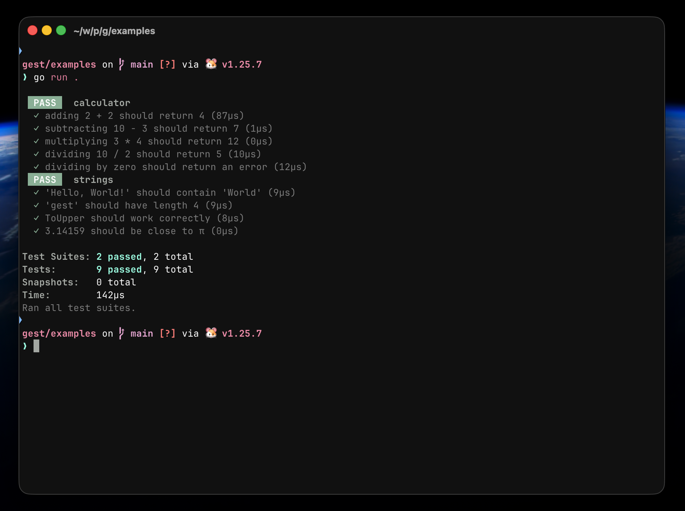
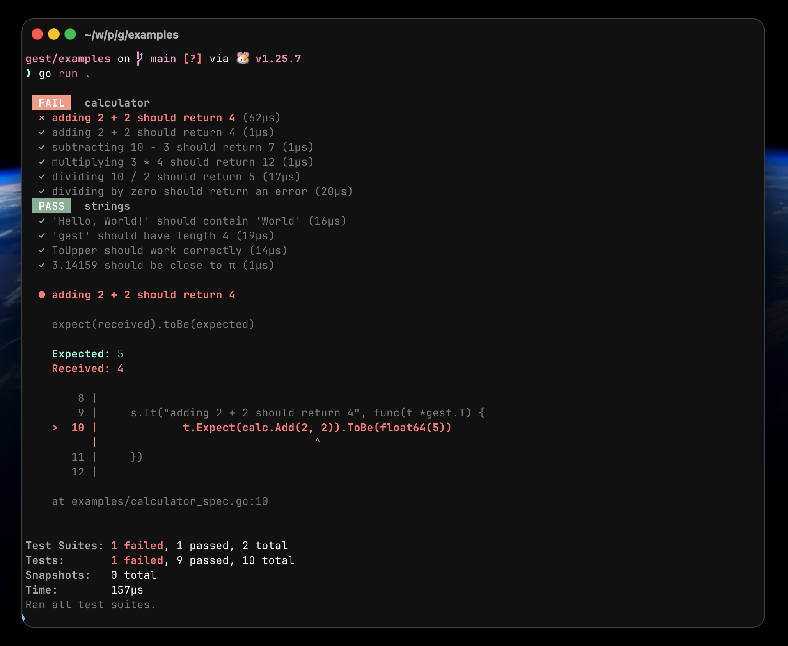
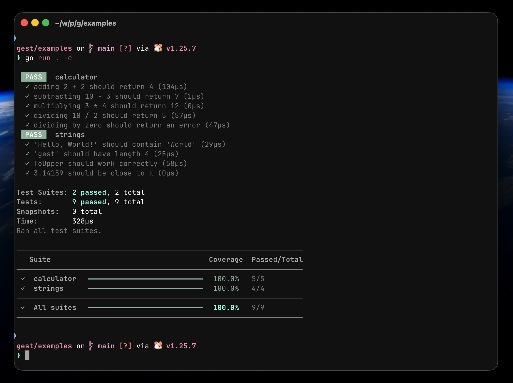

<div align="center">


<h1>gest 🧪</h1>

<p>A Jest-inspired testing library for Go — beautiful output, powered by <code>go test</code>.</p>

<p>
  <a href="https://pkg.go.dev/github.com/caiolandgraf/gest">
    
  </a>
  <a href="./LICENSE">
    
  </a>
</p>

<p>
  <a href="https://caiolandgraf.github.io/gest/"><strong>📖 Documentation</strong></a>
  &nbsp;·&nbsp;
  <a href="#installation">⚡ Quick Start</a>
  &nbsp;·&nbsp;
  <a href="#matchers">🔍 Matchers</a>
  &nbsp;·&nbsp;
  <a href="#full-api">📦 Full API</a>
</p>

</div>

---



## Motivation

Go's built-in `go test` is powerful but its output is raw. **gest** brings Jest's developer experience to Go: a fluent assertion API (`Describe` / `It` / `Expect`), colorized output, descriptive failure messages — all running on top of the native `go test` engine so you get caching, `-race`, real coverage and full IDE support for free.

## How it works

gest has two parts that work together:

| Part | What it does |
|---|---|
| **lib** `github.com/caiolandgraf/gest/gest` | Provides `Describe`, `It`, `Expect` and all matchers. You write tests with it inside standard `_test.go` files using `Suite.Run(t)`. |
| **CLI** `github.com/caiolandgraf/gest/cmd/gest` | Runs `go test -v -json` under the hood, parses the event stream, and renders the beautiful Jest-style output. |

## Installation

```bash
# Add the library to your project
go get github.com/caiolandgraf/gest

# Install the CLI globally
go install github.com/caiolandgraf/gest/cmd/gest@latest
```

## Project structure

```
my-project/
├── go.mod
├── calculator.go
├── calculator_test.go   ← standard Go test file using gest's API
├── user.go
└── user_test.go
```

> **Standard `_test.go` files.** gest now works with Go's native test convention.
> The `go test` toolchain discovers and runs them — gest just makes writing and
> reading them a pleasure.

## Basic usage

**`calculator_test.go`** — write tests with the Jest-style API, run them with `Suite.Run(t)`:

```go
package mypackage

import (
    "testing"

    "github.com/caiolandgraf/gest/gest"
)

func TestCalculator(t *testing.T) {
    calc := Calculator{}
    s := gest.Describe("calculator")

    s.It("adding 2 + 2 should return 4", func(t *gest.T) {
        t.Expect(calc.Add(2, 2)).ToBe(float64(4))
    })

    s.It("dividing by zero should return an error", func(t *gest.T) {
        _, err := calc.Divide(10, 0)
        t.Expect(err).Not().ToBeNil()
    })

    s.Run(t)
}
```

**Run with the gest CLI** to get the beautiful output:

```bash
gest ./...
```

**Or use plain `go test`** — everything still works, just without the colors:

```bash
go test ./...
```

## Watch mode

Pass `--watch` (or `-w`) to enter watch mode. gest re-runs `go test` automatically whenever any `.go` file changes — no recompilation overhead, just the native `go test` cache at full speed.

```bash
gest --watch          # watch mode
gest -w               # shorthand
gest --watch -c       # watch + coverage table
```

- Rapid saves are collapsed via a **30 ms debounce** — one clean result per save.
- The terminal is **cleared** before each re-run so the output is always fresh.
- Press `Ctrl+C` to stop.

## Failure messages

When a test fails, gest shows exactly what went wrong:



## Coverage

Pass `-c` or `--coverage` to display the per-suite pass rate table:

```bash
gest -c
gest --coverage
```



Bar colors: 🟢 green ≥ 80% · 🟡 yellow ≥ 50% · 🔴 red < 50%

## Matchers

| Matcher | Description |
|---|---|
| `.ToBe(v)` | Strict equality (`==`) |
| `.ToEqual(v)` | Deep equality (`reflect.DeepEqual`) |
| `.ToBeNil()` | Value is `nil` |
| `.ToBeTrue()` | Value is `true` |
| `.ToBeFalse()` | Value is `false` |
| `.ToContain(s)` | String contains substring |
| `.ToHaveLength(n)` | Length of string, slice or map |
| `.ToBeGreaterThan(n)` | Number greater than `n` |
| `.ToBeLessThan(n)` | Number less than `n` |
| `.ToBeCloseTo(n, delta?)` | Float approximately equal (default ±0.001) |

### Negation

Any matcher can be negated with `.Not()`:

```go
t.Expect(err).Not().ToBeNil()
t.Expect("gest").Not().ToContain("jest")
t.Expect(result).Not().ToBe(float64(0))
```

## Full API

```go
// Create a suite
s := gest.Describe("suite name")

// Add test cases — It() returns *Suite for chaining
s.It("description", func(t *gest.T) {
    t.Expect(value).ToBe(expected)
})

// Run all Its as subtests under a standard *testing.T
func TestMyFeature(t *testing.T) {
    s := gest.Describe("my feature")
    s.It("does something", func(t *gest.T) { ... })
    s.Run(t) // hands off to go test
}

// Fluent chaining
gest.Describe("calculator").
    It("adds", func(t *gest.T) { ... }).
    It("subtracts", func(t *gest.T) { ... }).
    Run(t)
```

## Example

See the [`examples/`](./examples) folder for a working project.

```bash
cd examples

# Run with the beautiful gest output
go run ../cmd/gest ./...

# Or plain go test
go test ./...

# With coverage table
go run ../cmd/gest -c ./...

# Watch mode
go run ../cmd/gest --watch
```

## Philosophy

- **Powered by `go test`** — caching, `-race` detector, real line coverage, IDE support, all for free
- **Familiar API** — if you know Jest, you already know gest
- **Beautiful output** — colors, progress bars, failure diffs
- **Zero friction** — standard `_test.go` files, no config, no separate test binary
- **Minimal dependencies** — only [fsnotify](https://github.com/fsnotify/fsnotify) for watch mode

## License

MIT

---

## Contributors

| | Name |
|---|---|
|  | [@caiolandgraf](https://github.com/caiolandgraf) |

---

<p align="center">Made with 🧪 by <a href="https://github.com/caiolandgraf">@caiolandgraf</a> · <a href="https://caiolandgraf.github.io/gest/">caiolandgraf.github.io/gest</a></p>